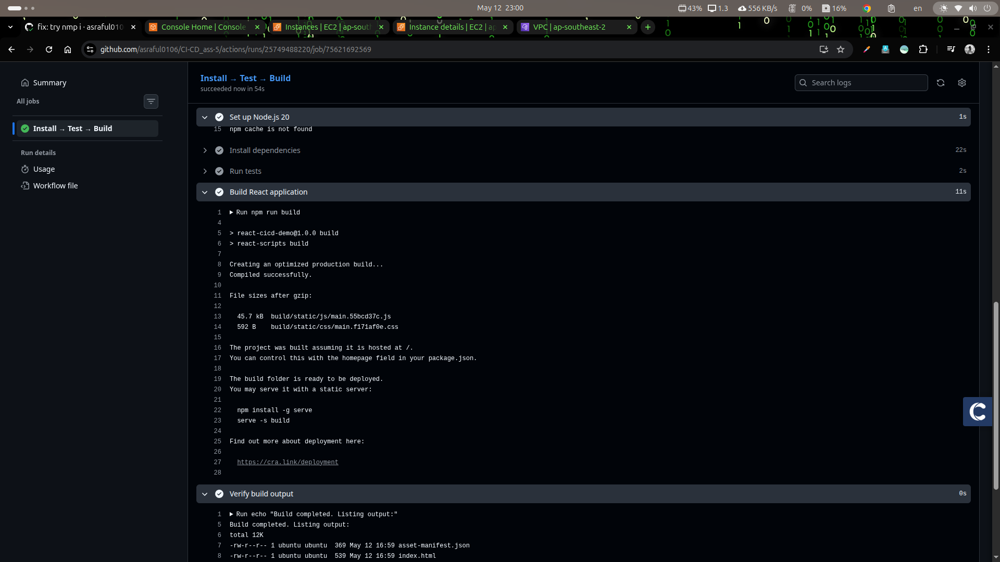
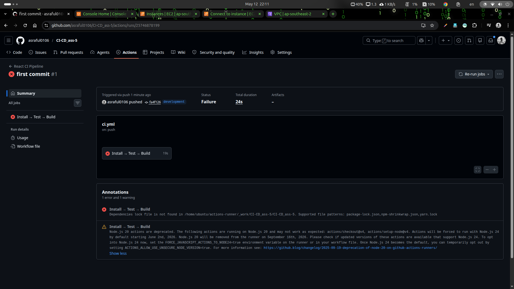
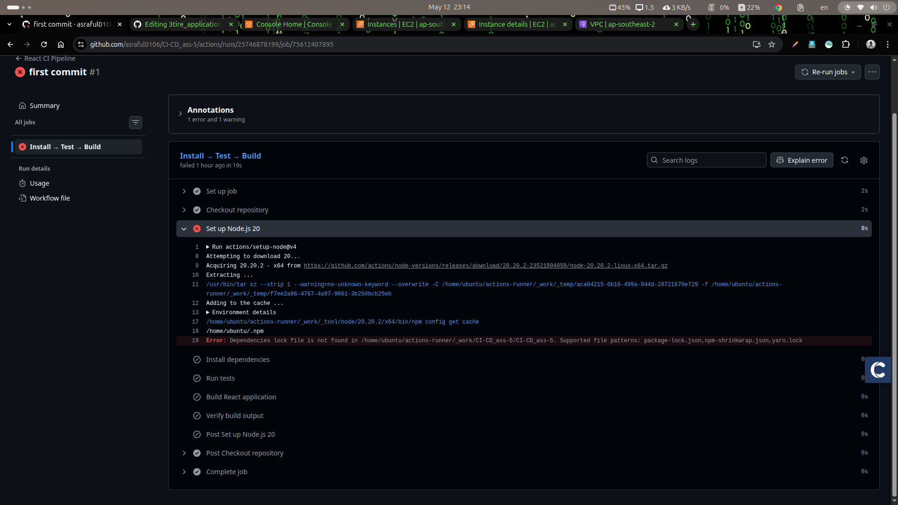

# GitHub Actions CI/CD — React Application
---

## What is CI/CD?

### Continuous Integration (CI)

**Continuous Integration** is the practice of automatically testing and validating code changes as soon as a developer pushes them to a shared repository. The goal is to detect bugs early — before they reach production — by running an automated pipeline on every change.

### Continuous Deployment (CD)

**Continuous Deployment** extends CI by automatically releasing validated code to a staging or production environment after the pipeline passes. Together, CI/CD creates a fully automated path from code commit to live deployment.

---

## GitHub Actions Architecture

GitHub Actions uses a layered structure to define what automation runs, when it runs, and where it runs.

```
Repository
└── .github/
    └── workflows/
        └── ci.yml          ← Workflow file (the automation definition)
            │
            ├── on: push    ← Trigger (what event starts the workflow)
            │
            └── jobs:
                └── build-and-test    ← Job (a unit of work)
                    │
                    ├── runs-on: self-hosted   ← Runner (where it runs)
                    │
                    └── steps:                 ← Steps (what to do)
                        ├── Checkout code
                        ├── Set up Node.js
                        ├── npm install (npm ci best for prod)
                        ├── npm test
                        └── npm run build
```

### Key Concepts

| Concept | Definition | Example |
|---|---|---|
| **Workflow** | An automated process defined in a YAML file. Stored in `.github/workflows/`. | `ci.yml` — runs on every push to development |
| **Trigger (`on:`)** | The event that starts the workflow. | `push` to the `development` branch |
| **Job** | A group of steps that run on the same machine. Multiple jobs can run in parallel. | `build-and-test` |
| **Step** | A single task within a job. Either a shell command or a reusable action. | `npm run build` |
| **Runner** | The machine that executes the steps. Can be GitHub-hosted or self-hosted. | My own computer (self-hosted) |
| **Action** | A pre-built, reusable step from the GitHub Marketplace. | `actions/checkout@v4` |

---

## What is a Self-Hosted Runner?

A **self-hosted runner** is a machine own and control (laptop, a desktop, a server, or a virtual machine) by us that is registered with GitHub to execute pipeline jobs instead of using GitHub's own infrastructure.

### How it works

1. Download the GitHub Actions runner application onto our machine.
2. We register it with our repository using a unique token from GitHub.
3. When a workflow is triggered, GitHub sends the job to our machine.
4. Our machine executes the job, streams logs back to GitHub, and reports success or failure.

## 5. Project Structure

```
github-actions-assignment/
│
├── .github/
│   └── workflows/
│       └── ci.yml              ← The CI pipeline definition
│
├── src/
│   ├── App.js                  ← Main React component
│   ├── App.css                 ← Component styles
│   ├── App.test.js             ← Unit tests (run in the pipeline)
│   ├── index.js                ← React entry point
│   └── index.css               ← Global styles
│
├── public/
│   └── index.html              ← HTML template
│
├── package.json                ← Dependencies and scripts
├── .gitignore                  ← Files excluded from git
└── README.md                   ← This file
```

---

## 6. Workflow YAML — Explained

Full file: `.github/workflows/ci.yml`

```yaml
# The display name shown in the GitHub Actions tab
name: React CI Pipeline

# ─── TRIGGER ──────────────────────────────────────────────
# Runs automatically on every push to the 'development' branch.
# workflow_dispatch also allows manual triggering from GitHub UI.
on:
  push:
    branches:
      - development
  workflow_dispatch:

# ─── JOBS ─────────────────────────────────────────────────
jobs:
  build-and-test:
    name: Install → Test → Build

    # KEY LINE: uses my registered self-hosted runner
    # Change to 'ubuntu-latest' to use a GitHub-hosted runner instead
    runs-on: self-hosted

    # ─── STEPS ──────────────────────────────────────────
    steps:

      # Step 1: Download the repository code onto the runner
      - name: Checkout repository
        uses: actions/checkout@v4

      # Step 2: Install the correct Node.js version
      # 'cache: npm' speeds up future runs by reusing node_modules
      - name: Set up Node.js 20
        uses: actions/setup-node@v4
        with:
          node-version: "20"
          cache: "npm"

      # Step 3: Install exact dependency versions from package-lock.json
      # 'npm ci' is used instead of 'npm install' because:
      #   - It installs exact locked versions (reproducible builds)
      #   - It fails if package-lock.json is out of sync
      #   - It deletes node_modules before installing (clean slate)
      - name: Install dependencies
        run: npm install

      # Step 4: Run the test suite
      # --watchAll=false : don't watch for changes, just run once
      # --passWithNoTests: don't fail if no test files exist
      - name: Run tests
        run: npm test -- --watchAll=false --passWithNoTests

      # Step 5: Build the React app for production
      # Creates optimised static files in the /build directory
      - name: Build React application
        run: npm run build

      # Step 6: Confirm the build output exists
      - name: Verify build output
        run: |
          echo "Build completed. Listing output:"
          ls -lh build/
```

### Why `npm ci` instead of `npm install`?

| `npm install` | `npm ci` |
|---|---|
| Updates `package-lock.json` | Requires `package-lock.json` to exist |
| May install slightly different versions | Installs exact locked versions |
| Fine for local development | Required for CI pipelines |
| Faster on first run | Faster overall (skips resolution step) |

---

## Setting Up the Self-Hosted Runner

### Step 1 — Open runner settings in GitHub

In my repository:

```
Settings → Actions → Runners → New self-hosted runner
```

Select operating system.

### Step 2 — Download the runner application

GitHub shows us the exact commands. On Linux they look like:

```bash
# Create a directory for the runner
mkdir ~/actions-runner && cd ~/actions-runner

# Download the runner package (use the version shown by GitHub)
curl -o actions-runner-linux-x64-2.x.x.tar.gz -L \
  https://github.com/actions/runner/releases/download/v2.x.x/actions-runner-linux-x64-2.x.x.tar.gz

# Extract it
tar xzf ./actions-runner-linux-x64-2.x.x.tar.gz
```

### Step 3 — Configure the runner

GitHub provides a unique token. Run the configure command:

```bash
./config.sh \
  --url https://github.com/MY_USERNAME/MY_REPO \
  --token MY_UNIQUE_TOKEN_FROM_GITHUB
```

During setup I was asked:
- Runner group: press Enter for default
- Runner name: press Enter to use my machine's hostname
- Labels: press Enter for default (`self-hosted`)
- Work folder: press Enter for `_work`

### Step 4 — Start the runner

**For a quick one-time test:**
```bash
./run.sh
```

**For a persistent background service (recommended):**
```bash
# Install as a system service
sudo ./svc.sh install

# Start the service
sudo ./svc.sh start

# Check it's running
sudo ./svc.sh status
```

### Step 5 — Verify it appears in GitHub

Go back to **Settings → Actions → Runners**. My machine should appear with a green dot and status **Idle**. It is now ready to pick up jobs.

> ⚠️ **Important:** The runner must be online (service running) whenever I push the code. If the runner is offline, the job will queue and wait indefinitely.

---

## Running the Pipeline

### First-time setup

```bash
# 1. Clone the repository
git clone https://github.com/MY_USERNAME/MY_REPO.git
cd my_REPO

# 2. Switch to (or create) the development branch
git checkout -b development


# 4. Push to trigger the pipeline
git add .
git commit -m "feat: add GitHub Actions CI pipeline"
git push origin development
```

### Triggering subsequent runs

Any push to `development` triggers the pipeline automatically:

```bash
# Make a change to any file
echo "# updated" >> README.md

# Stage, commit, push
git add .
git commit -m "chore: trigger CI pipeline"
git push origin development
```

Then go to **Actions** tab in my GitHub repository to watch the run live.

---

## Workflow Execution Process

This section explains exactly what happens from the moment I push the code to when the pipeline completes.

```
When run: git push origin development
         │
         ▼
GitHub detects a 'push' event on the 'development' branch
         │
         ▼
GitHub reads .github/workflows/ci.yml
         │
         ▼
GitHub queues the 'build-and-test' job
         │
         ▼
My self-hosted runner (idle, polling GitHub) picks up the job
         │
         ▼
Runner executes steps in order:
  [1] actions/checkout@v4  →  Downloads my code into the runner workspace
  [2] actions/setup-node@v4 →  Installs Node.js 20 (or restores from cache)
  [3] npm ci               →  Installs exact dependencies from package-lock.json
  [4] npm test             →  Runs all *.test.js files; fails if any test fails
  [5] npm run build        →  Creates production build in /build directory
  [6] ls -lh build/        →  Lists build output to confirm it was created
         │
         ▼
Runner reports result back to GitHub (pass ✅ or fail ❌)
         │
         ▼
GitHub shows result on:
  • The commit (green ✓ or red ✗ icon next to the commit hash)
  • The Actions tab (full log of every step)
  • Pull requests (blocks merge if failed — configurable)
```

### What happens if a step fails?

- The current step exits with a non-zero code (indicating error).
- All subsequent steps are **skipped** automatically.
- The job is marked **failed** (red ✗).
- GitHub can send me an email notification.
- The detailed error log is available in the Actions tab.

---

## Debugging Pipeline Failures

### Where to find logs

```
GitHub Repository
  → Actions tab
    → Click the failed workflow run
      → Click the job name ("Install → Test → Build")
        → Click the failed step (marked with red ✗)
          → Read the full output
```

The error message and the exact line that failed are always visible in the expanded step log.

---

### Common failures and how to fix them

#### Runner offline — job stays queued forever

**Symptom:** The job shows as "Queued" indefinitely in the Actions tab.

**Cause:** my self-hosted runner is not running.

**Fix:**
```bash
# SSH into my runner machine and start the service
cd ~/actions-runner
./run.sh

# Or restart the background service
sudo ./svc.sh start
sudo ./svc.sh status
```

---

#### `npm ci` fails — lock file error

**Symptom:**
```
npm ci can only install packages when my package.json and
package-lock.json are in sync.
```

**Cause:** `package-lock.json` is missing from the repo or out of sync with `package.json`.

**Fix:**
```bash
# Regenerate the lock file locally
npm install

# Commit it
git add package-lock.json
git commit -m "fix: add package-lock.json"
git push origin development
```

---

#### Build fails — compile error

**Symptom:**
```
Failed to compile.
src/App.js
  Line 12:  'useState' is not defined
```

**Cause:** A syntax error, missing import, or type error in my source code.

**Fix:** Read the error message carefully — it shows file name and line number. Fix locally, verify with `npm run build`, then push.

---

#### Tests fail

**Symptom:**
```
FAIL src/App.test.js
  ✕ renders CI/CD demo heading (23ms)
  ● renders CI/CD demo heading
    Unable to find element with text: /React CI\/CD Demo/i
```

**Cause:** The test expects text or a component that doesn't match the rendered output.

**Fix:** Either update the component to match the test, or update the test to match the component. Run `npm test` locally to confirm it passes before pushing.

---

#### Permission denied

**Symptom:**
```
EACCES: permission denied, mkdir '/home/runner/_work/...'
```

**Cause:** The runner process does not have write access to its workspace directory.

**Fix:**
```bash
# Check the runner's workspace permissions
ls -la ~/actions-runner/_work/

# Fix ownership (replace 'myuser' with my actual username)
sudo chown -R myuser:myuser ~/actions-runner/_work/
```

> ⚠️ Never run the runner as `root`. It is a security risk.


### Screenshot A — Successful pipeline run
Successfull Pipeline | `images/succ_1.png`


### Screenshot B — Failed pipeline with debug logs


Failed Pipeline | `images/err_1.png`


Failed Pipeline With Log | `images/err_2.png`


## Quick Reference Commands

```bash
# Clone and set up
git clone https://github.com/MY_USERNAME/MY_REPO.git
cd MY_REPO
git checkout -b development

# Install dependencies locally
npm install

# Run tests locally
npm test

# Build locally
npm run build

# Push to trigger CI pipeline
git add .
git commit -m "my message"
git push origin development

# Start self-hosted runner (one-time)
cd ~/actions-runner && ./run.sh

# Start self-hosted runner (background service)
sudo ./svc.sh start

# Stop self-hosted runner service
sudo ./svc.sh stop

# Check runner service status
sudo ./svc.sh status
```
